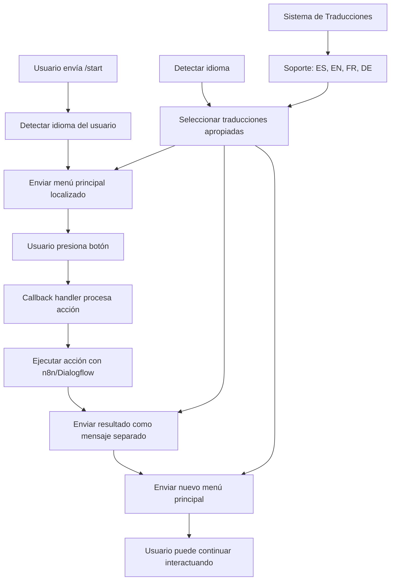

# Telegram Bot Project

## Descripción
Bot de Telegram multilingüe en Python con botones de respuesta rápida. Incluye sistema completo de internacionalización con soporte para español, inglés, francés y alemán. Integrado con Dialogflow CX para procesamiento de conversaciones y n8n para flujos de trabajo y llamadas a APIs de IA.

## Funcionalidades Principales
- ✅ **Sistema Multilingüe**: Detección automática de idioma basada en configuración de Telegram
- ✅ **Botones Interactivos**: Respuesta rápida con botones inline para confirmar acciones
- ✅ **Flujo Continuo**: Después de cada acción, se muestra automáticamente el menú principal
- ✅ **Integración Dialogflow**: Procesamiento inteligente de conversaciones
- ✅ **Integración n8n**: Ejecución de flujos de trabajo y llamadas a APIs
- ✅ **Historial Limpio**: Mantiene el menú original visible y agrega resultados como mensajes separados

## Estructura del Proyecto
```
telegram-bot/
├── src/
│   ├── __init__.py
│   ├── bot.py              # Código principal del bot
│   ├── handlers.py         # Handlers para mensajes y botones
│   ├── config.py           # Configuraciones (tokens, etc.)
│   ├── translations.py     # Sistema de internacionalización
│   └── integrations/       # Módulos para integraciones
│       ├── __init__.py
│       ├── dialogflow.py   # Integración con Dialogflow CX
│       └── n8n.py          # Integración con n8n
├── config/
│   └── settings.json       # Configuraciones JSON
├── tests/
│   ├── __init__.py
│   └── test_bot.py         # Pruebas unitarias
├── requirements.txt        # Dependencias
├── .env                    # Variables de entorno (token del bot)
├── .env.example            # Ejemplo de variables de entorno
└── README.md               # Este archivo
```

## Arquitectura del Código
- **bot.py**: Inicializa el bot y registra handlers.
- **handlers.py**: Maneja mensajes de texto y callbacks de botones con soporte multilingüe.
- **translations.py**: Sistema completo de internacionalización con diccionarios de traducciones.
- **config.py**: Carga configuraciones desde archivos y variables de entorno.
- **integrations/**: Módulos modulares para Dialogflow (procesamiento de conversaciones) y n8n (ejecución de flujos y llamadas a APIs), ambos con soporte i18n.

## Diagrama de Flujo


## Sistema Multilingüe (i18n)

### Idiomas Soportados
- 🇪🇸 **Español** (predeterminado)
- 🇺🇸 **Inglés**
- 🇫🇷 **Francés**
- 🇩🇪 **Alemán**

### Detección de Idioma
El bot detecta automáticamente el idioma del usuario basado en la configuración de Telegram:
- Lee `update.effective_user.language_code`
- Soporta códigos como: `es`, `en`, `fr`, `de` y sus variantes (`es-ES`, `en-US`, etc.)
- Si no reconoce el código, usa español como predeterminado

### Configuración de Idioma
**Para cambiar el idioma:**
1. En Telegram: Configuración → Idioma → Seleccionar idioma
2. Reiniciar el bot con `/start`

**Para forzar un idioma específico:**
```python
# En src/translations.py
DEFAULT_LANGUAGE = 'en'  # Cambiar a 'es', 'fr', 'de' según necesites
```

## Integraciones

### Dialogflow CX
- ✅ **Implementado**: Procesamiento inteligente de conversaciones
- ✅ **Multilingüe**: Respuestas localizadas según idioma del usuario
- **Ubicación**: `integrations/dialogflow.py`

### n8n
- ✅ **Implementado**: Ejecución de flujos de trabajo
- ✅ **Multilingüe**: Resultados localizados
- **Ubicación**: `integrations/n8n.py`

## Dependencias
- ✅ **python-telegram-bot**: Para interactuar con la API de Telegram
- ✅ **requests**: Para llamadas HTTP a integraciones
- ✅ **python-dotenv**: Para manejar variables de entorno

## Instalación y Configuración

### 1. Instalar dependencias
```bash
pip install -r requirements.txt
```

### 2. Configurar variables de entorno
```bash
cp .env.example .env
# Editar .env con tus tokens
```

### 3. Ejecutar el bot
```bash
python -m src.bot
```

## Ejemplos de Uso

### Flujo en Español
```
Usuario: /start
Bot: ¡Hola! Soy tu bot. Elige una opción: [Confirmar Acción 1] [Confirmar Acción 2] [Ayuda]

Usuario: [Click en Confirmar Acción 1]
Bot: Acción 1 confirmada. Resultado: Resultado de n8n para acción: action1
Bot: ¡Hola! Soy tu bot. Elige una opción: [Confirmar Acción 1] [Confirmar Acción 2] [Ayuda]
```

### Flujo en Inglés
```
Usuario: /start
Bot: Hello! I am your bot. Choose an option: [Confirm Action 1] [Confirm Action 2] [Help]

Usuario: [Click en Confirm Action 1]
Bot: Action 1 confirmed. Result: n8n result for action: action1
Bot: Hello! I am your bot. Choose an option: [Confirm Action 1] [Confirm Action 2] [Help]
```

## Estado del Proyecto
- ✅ **Código básico del bot**: Implementado y funcional
- ✅ **Sistema multilingüe**: Completamente implementado
- ✅ **Integración Dialogflow**: Implementada con soporte i18n
- ✅ **Integración n8n**: Implementada con soporte i18n
- ✅ **Flujo de continuidad**: Implementado
- ✅ **Pruebas básicas**: Código probado y funcional

## Próximos Pasos
1. ✅ **Implementado**: Sistema multilingüe completo
2. ✅ **Implementado**: Integraciones Dialogflow y n8n
3. 🔄 **En progreso**: Expandir pruebas unitarias
4. 🔄 **Pendiente**: Agregar logging avanzado
5. 🔄 **Pendiente**: Implementar manejo de errores robusto